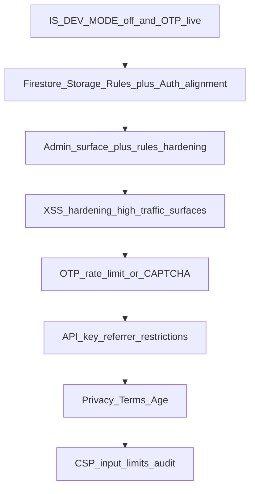

# תוכנית אבטחה לפרסום ציבורי (קונקשן)

התוכנית מבוססת על הסעיפים שסיכמנו, עם הרחבה קצרה בסוף לנושאים שלא פורטו במלואם.

---

## חלק א — חסמים לפני פרסום ציבורי

### א1. מצב פיתוח ואימות מייל
- בקובץ [`config.js`](d:\קלוד קוד\תחביבים\config.js): לוודא `IS_DEV_MODE === false` בפרודקשן.
- לבדוק end-to-end: שליחת OTP דרך EmailJS, תוקף 10 דקות, ושאין יותר `alert`/`console.log` עם קוד בפרודקשן (הלוגיקה ב-[`auth.js`](d:\קלוד קוד\תחביבים\auth.js)).

### א2. Firestore ו-Storage Rules (מקור האמת: Firebase Console)
- אין ב-repo קובץ `firestore.rules` — הכללים חייבים להיות מתועדים ומסונכרנים עם מה שבפועל בפרויקט.
- לפתור את אי-ההתאמה שתועדה ב-[`CLAUDE.md`](d:\קלוד קוד\תחביבים\CLAUDE.md): כללים שמסתמכים על `request.auth` לא יעבדו למסלול **מייל+OTP** אם אין `firebase.auth()` אחרי האימות (בעוד שמסלול **Google** כן משתמש ב-`signInWithPopup` ב-[`register.html`](d:\קלוד קוד\תחביבים\register.html)).
- לבחור אחת מהאסטרטגיות (משפיעה על כמות עבודה):
  - **א)** להוסיף התחברות Firebase לכל המשתמשים (למשל Custom Token מ-Cloud Function אחרי אימות OTP בצד שרת, או Email Link Auth) ואז לחדד Rules לפי `uid`/אימייל.
  - **ב)** להשאיר מודל ללא Auth לכתיבות — אז Rules חייבים להיות מוגבלים בצורה אחרת (נדיר ובדרך כלל לא מומלץ לפרסום ציבורי).

### א3. לוח ניהול
- [`admin.html`](d:\קלוד קוד\תחביבים\admin.html) מסתמך על `getSession()` + השוואה ל-`ADMIN_EMAIL` בצד הלקוח בלבד.
- לפרסום: לוודא ש-**Rules** לא מאפשרים קריאת/כתיבת נתונים רגישים ללא אימות; לא להסתמך על כך ש-URL של האדמין "מוסתר".
- אופציונלי חזק: Custom Claims לאדמין + בדיקת Claims בצד שרת (Function) לפעולות מחיקה/עריכה המונית.

---

## חלק ב — סיכונים בינוניים (מומלץ לפני או מיד אחרי השקה)

### ב1. XSS (תוכן משתמש ב-`innerHTML`)
- מיפוי נקודות עם `innerHTML` שמזריקות שדות מ-Firestore/קלט (למשל [`js/profiles-ui.js`](d:\קלוד קוד\תחביבים\js\profiles-ui.js), [`js/profiles-matches.js`](d:\קלוד קוד\תחביבים\js\profiles-matches.js), [`js/profiles-chat.js`](d:\קלוד קוד\תחביבים\js\profiles-chat.js), [`admin.html`](d:\קלוד קוד\תחביבים\admin.html)).
- פתרון עקבי: בריחת HTML (`&lt;`, `&amp;`, …) או בנייה עם DOM API / תבניות בטוחות; אם נדרש HTML עשיר — DOMPurify עם whitelist מצומצם.

### ב2. הגנה מפני ניצול OTP / EmailJS
- היום שליחת OTP מהדפדפן — חשוף לספאם.
- להוסיף לפחות אחד: rate limit בצד שרת (Cloud Function + Firestore counter / Upstash), reCAPTCHA v3, או מגבלת תדירות לפי IP/מייל בתבנית EmailJS אם נתמך.

### ב3. הגבלת מפתח Firebase (Google Cloud)
- להגדיר **HTTP referrer restrictions** למפתח ה-API של האפליקציה (דומיין הפרודקשן + preview אם צריך).

### ב4. ארטיפקטים בפריסה
- לבדוק אם קבצים כמו `profiles (2).html` נכללים בדיפלוי; אם כן — להסיר או להוציא מה-hosting כדי למנוע חשיפת URL-ים/לוגיקה מיותרת.

### ב5. מסמכי שקיפות
- מדיניות פרטיות, תנאי שימוש, ואישור גיל (למשל 18+) — נדרשים לפרסום ציבורי ולמדיניות חנויות האפליקציות, לא רק "אבטחה טכנית".

---

## חלק ג — נמוך / תחזוקה (כדאי לתעד)

### ג1. סשן ב-`localStorage`
- להסביר למשתמשים (במדיניות) ולצוות: סיכון XSS = סיכון חשבון; לשקול refresh token רק אם יעברו לארכיטקטורה עם שרת.

### ג2. `ADMIN_EMAIL` בקוד
- לא חור קריטי; אפשר להעביר ל-config חיצוני / env בזמן build אם יעברו לכלי build.

---

## חלק ד — תוספות שלא פורטו קודם (מומלץ לרשום בתוכנית האבטחה)

### ד1. Content-Security-Policy (CSP)
- אם ה-hosting מאפשר headers (למשל [`vercel.json`](d:\קלוד קוד\תחביבים\vercel.json)): CSP שמגביל `script-src` (במיוחד אם משתמשים ב-`cdn.tailwindcss.com` וסקריפטים חיצוניים) — מאזן בין אבטחה לבין תחזוקה.

### ד2. אימות קלט ואורך שדות
- הגבלת אורך הודעות בצ'אט, שדות אירוע, ודיווח — מפחית DoS קל ושגיאות.

### ד3. ביקורת תלויות
- `npm audit` / עדכון גרסאות CDN קריטיות (Firebase SDK) בתדירות קבועה.

---

## סדר ביצוע מומלץ

לאחר א1–א2 המוצר יכול להיות "פרסום מוגבל"; אחרי ב1–ב3 וב5 מתקרבים ל"פרסום ציבורי אחראי".
